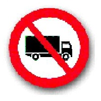
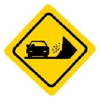
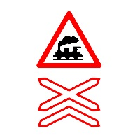
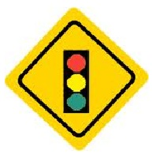
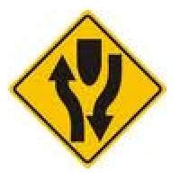
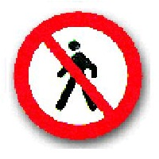
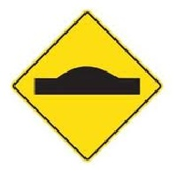
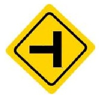

- ¿Qué significa esta señal?

| Señal        | Significado  |
| ------------ | ------------ |
|  | Incorporación de tránsito. |
|  | Prohibido adelantarse. |
|  | Vía de doble circulación. |
|  | Ancho máximo permitido. |
|  | Obras. |
|  | Prohibido circular camiones. |
|  | Zona de derrumbe. |
|  | Cruce de varias vías férreas. Paso a nivel peligroso. |
|  | Proximidad de semáforo. |
|  | Inicio/Fin de camino dividido. |
|  | Prohibido circular peatones. |
|  | Elevación transversal lomo de burro. |
|  | Sentido de circulación obligatoria. |
|  | Camino lateral. |

- La licencia de conducir debe contener obligatoriamente los siguientes datos:  
**Nombre y apellido completo, clase de licencia, número de documento y fecha de vencimiento.**

- ¿Cuándo se produce el "efecto túnel", es decir la reducción del campo visual en la conducción?  
**Al aumentar la velocidad.**

- La sucesión de líneas transversales blancas continuas indican que:  
**Debo reducir la velocidad.**

- ¿Está permitido en los vehículos agregar en los paragolpes aditamentos (defensas, etc.) de cualquier naturaleza, que puedan considerarse peligrosos para personas u otros vehículos?  
**No, no está permitido modificar paragolpes originales de fábrica agregándoles elementos que puedan considerarse peligrosos o agresivos.**

- ¿Es necesario tener licencia de conducir para conducir ciclomotores?  
**Sí, es obligatorio poseer licencia para conducir ciclomotores.**

- ¿Qué es el alcohol?  
**Es una sustancia que deprime el sistema nervioso central.**

- ¿En caso de un accidente que nos involucre, es obligatorio?  
**Detenerse inmediatamente, tomando las precauciones necesarias.**

- Llevar matafuegos en un automóvil, ¿es exigible por ley?  
**Sí, es exigible por ley.**

- ¿Son obligatorios en el automóvil los sistemas autónomo de limpieza, lavado y desempañado de parabrisas, sistema retrovisor, bocina de sonoridad y los vidrios de seguridad?  
**Sí, en todos los casos.**

- Según la Ley Nacional Nº 24.449, los vidrios de seguridad de un vehículo tienen que tener tonalidad adecuada; esto significa que:  
**Desde fábrica los vehículos se comercializan con una tonalidad adecuada en sus vidrios, cumpliendo las condiciones de seguridad.**

- ¿Dónde debe tener las manos la persona que está conduciendo un automotor?  
**Ambas sobre el volante de dirección, excepto cuando sea necesario accionar otros comandos.**

- ¿Cuál es la velocidad máxima en ciudad para un automóvil en calles?  
**40km/h.**

- ¿En un automóvil, pueden viajar 9 personas mayores?  
**No.**

- En un automóvil, ¿dónde debe ubicarse el matafuegos?  
**Dentro del habitáculo, firmemente amarrado.**

- La tolerancia máxima de alcohol en sangre para conductores de automóviles es de:  
**0,5 gr/1000 cm3.**

- ¿Cuál es la velocidad máxima permitida en rutas cuando atravesamos zonas urbanas?  
**60 km por hora.**

- Una persona que experimenta un fuerte estado emocional de ira, ansiedad o euforia, está en condiciones de conducir:  
**No puede conducir, porque presenta serios déficit de atención que dificultan la ejecución de una tarea tan compleja como la conducción.**

- Si circulo con mi vehículo y veo dos líneas paralelas blancas de trazo continuo o discontinuo, transversales a la vía o numerosas franjas blancas paralelas al sentido de circulación, tipo cebrado:  
**Debo dar prioridad de cruce a los peatones porque estoy frente a una senda peatonal.**

- ¿A qué se denomina vehículo automotor?  
**Todo vehículo de más de dos ruedas que tiene motor y tracción propia.**

- Si circulo en una ruta detrás de un camión, y éste hace señas manuales y/o con la luz de giro derecha para que lo pase, ¿qué se debe hacer?  
**Quedarse en el carril hasta que con los propios ojos se observa el camino y se comprueba que se tiene la vía libre en una distancia suficiente para evitar todo riesgo al sobrepasar.**

- Después de realizar un adelantamiento, tiene usted la obligación de señalizar la maniobra de volver al carril derecho?  
**Sí, porque altero de nuevo mi posición en la calzada.**

- ¿A qué se denomina vehículo estacionado?  
**El que permanece detenido por más tiempo del necesario para el ascenso descenso de pasajeros o carga, o del impuesto por circunstancias de la circulación o cuando tenga al conductor fuera de su puesto.**

- Las señales verticales de prevención transmiten:  
**Advertencias sobre características de la vía.**

- En caso de niebla, se debe circular con:  
**Luz bajas.**

- ¿Cuál es la velocidad mínima para un automóvil en autopistas?  
**65km/h.**

- Si conduce un automóvil que tenga air-bag en la parte delantera, ¿es obligatorio abrocharse el cinturón de seguridad?  
**Sí, la obligatoriedad es indistinta del air-bag.**

- Con una licencia clase B1 podrá conducir:  
**Automóviles y pick-up cuyo peso total no supere los 3500kg.**

- ¿Qué elemento contra incendios es reglamentario para automóviles?  
**Matafuegos de 1 kilogramo mínimo con indicador de presión de carga.**

- ¿Qué actitud se debe tomar en caso de niebla?  
**Disminuir la velocidad, encender las luces bajas o antiniebla, y no detenerse.**

- ¿Qué características deben tener los faros delanteros de un vehículo?  
**Luz blanca o amarilla en no más de dos pares, con alta y baja, ésta de proyección asimétrica.**

- ¿Son obligatorios los dispositivos de protección contra encandilamiento solar, corte rápido de energía y sistema motriz de retroceso?  
**Sí, en todos los casos.**

- ¿Qué identifica la Cruz de San Andrés?  
**Cruce ferroviario.**

- Las alteraciones más importantes producidas por la somnolencia y que afectan la conducción son:  
**La alteración de las funciones sensoriales, de la percepción, una menor concentración y más distracciones, toma de decisiones más lenta y más errores.**

- ¿Qué características deben tener las luces de freno traseras?  
**De color rojo, encenderán al accionarse el mando de frenos antes de actuar éste.**

- En el vehículo que usted conduce va a viajar como pasajero su hijo de 2 años; está permitido que lo haga en el asiento trasero?  
**Sí, pero se debe utilizar una silla o dispositivo especial de retención infantil.**

- ¿Qué debe hacer si extravía o le roban la chapa o placa patente?  
**Realizar denuncia policial y el pedido de reposición al Registro de la Propiedad Automotor.**

- ¿A qué se denomina carretón?  
**El vehículo especial, cuya capacidad de carga, tanto en peso como en dimensiones, supera la de los vehículos convencionales.**

- ¿De qué color deben ser las luces de giro de un vehículo?  
**Intermitentes de color amarillo, delante y atrás.**

- ¿Puede un conductor llevar a menores de 10 años en los asientos delanteros?  
**No.**

- La licencia habilitante clase B1, ¿incluye la posibilidad de conducir un motovehículo?  
**No, es habilitante para conducir automóviles y pick-up hasta 3500kg.**

- ¿Cuál es la manera menos peligrosa de trasladar un bebé en un automóvil?  
**En sillas especialmente adaptadas con cinturón de seguridad, en el asiento trasero.**

- Circulando en el ámbito de la ciudad, ¿es obligatorio llevar abrochado el cinturón de seguridad?  
**Sí, siempre que el vehículo esté en circulación.**

- ¿Qué tipo de defensas adicionales al paragolpes está permitido utilizar en una pick-up?  
**No está permitido utilizar defensas.**

- ¿A qué se denomina banquina?  
**La zona de la vía contigua a una calzada pavimentada, de un ancho de hasta tres metros, si no está delimitada.**

- En una rotonda ¿quién tiene la prioridad de paso?  
**Quien gira por sobre el conductor que quiere ingresar, por más que este último tenga la derecha.**

- Si una bicicleta viene circulando por la derecha, ¿tiene prioridad de paso, en un cruce de calles, como sucede con los automóviles?  
**No, las bicicletas, al igual que cualquier vehículo de tracción a sangre o cuando se conduzcan animales, no tienen prioridad de paso en las encrucijadas aunque circulen por la derecha.**

- El conductor que estaciona y desciende del vehículo ¿Puede caminar por la calzada?  
**Alrededor de su vehículo.**

- ¿De qué color debe ser la luz de retroceso?  
**Blanca.**

- Según la Ley Nacional Nº 24.449, cuál es el límite mínimo de velocidad obligatorio para zona urbana y autopistas?  
**La mitad del máximo fijado para cada tipo de vía.**

- Si el titular de la Licencia de Conducir cambia su domicilio real a otra localidad. ¿Cómo debe proceder?  
**Tiene noventa (90) días para denunciar el nuevo domicilio y actualizar su licencia de conducir en la nueva localidad en que reside.**

- ¿Es un requisito saber leer para obtener la licencia de conducir?  
**Saber leer y para los conductores profesionales también escribir.**
