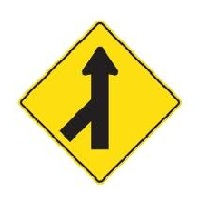
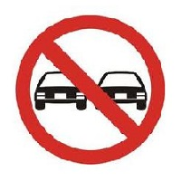
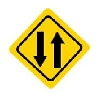
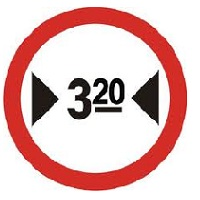
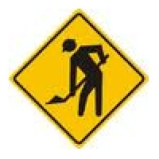

- La licencia de conducir debe contener obligatoriamente los siguientes datos:  
**Nombre y apellido completo, clase de licencia, número de documento y fecha de vencimiento.**

- ¿Qué significa esta señal?
 
  
**Incorporación de tránsito.**
 
 
  
**Prohibido adelantarse.**
 
 
  
**Vía de doble circulación.**
 
 
  
**Ancho máximo permitido.**
 
 
  
**Obras.**

- ¿Cuándo se produce el "efecto túnel", es decir la reducción del campo visual en la conducción?  
**Al aumentar la velocidad.**

- La sucesión de líneas transversales blancas continuas indican que:  
**Debo reducir la velocidad.**

- ¿Está permitido en los vehículos agregar en los paragolpes aditamentos (defensas, etc.) de cualquier naturaleza, que puedan considerarse peligrosos para personas u otros vehículos?  
**No, no está permitido modificar paragolpes originales de fábrica agregándoles elementos que puedan considerarse peligrosos o agresivos.**

- ¿Es necesario tener licencia de conducir para conducir ciclomotores?  
**Sí, es obligatorio poseer licencia para conducir ciclomotores.**

- ¿Qué es el alcohol?  
**Es una sustancia que deprime el sistema nervioso central.**

- ¿En caso de un accidente que nos involucre, es obligatorio?  
**Detenerse inmediatamente, tomando las precauciones necesarias.**

- Llevar matafuegos en un automóvil, ¿es exigible por ley?  
**Sí, es exigible por ley.**

- ¿Son obligatorios en el automóvil los sistemas autónomo de limpieza, lavado y desempañado de parabrisas, sistema retrovisor, bocina de sonoridad y los vidrios de seguridad?  
**Sí, en todos los casos.**

- Según la Ley Nacional Nº 24.449, los vidrios de seguridad de un vehículo tienen que tener tonalidad adecuada; esto significa que:  
**Desde fábrica los vehículos se comercializan con una tonalidad adecuada en sus vidrios, cumpliendo las condiciones de seguridad.**

- ¿Dónde debe tener las manos la persona que está conduciendo un automotor?  
**Ambas sobre el volante de dirección, excepto cuando sea necesario accionar otros comandos.**

- ¿Cuál es la velocidad máxima en ciudad para un automóvil en calles?  
**40km/h.**

- ¿En un automóvil, pueden viajar 9 personas mayores?  
**No.**

- En un automóvil, ¿dónde debe ubicarse el matafuegos?  
**Dentro del habitáculo, firmemente amarrado.**

- La tolerancia máxima de alcohol en sangre para conductores de automóviles es de:  
**0,5 gr/1000 cm3.**
